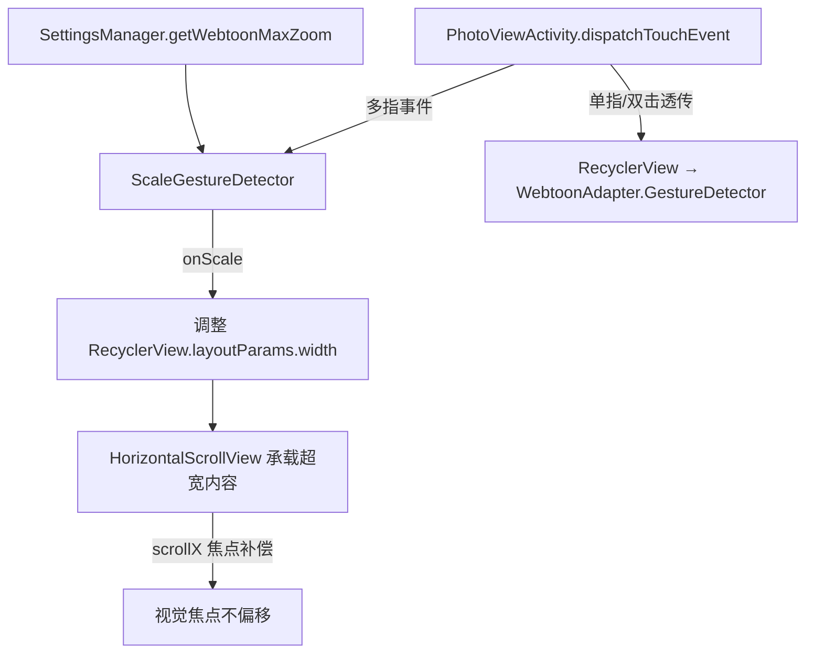

## 用户需求

为条漫（Webtoon）模式增加双指捏合缩放功能。

## 产品概述

在 `PhotoViewActivity` 的条漫模式下，用户可通过双指捏合手势对阅读内容进行横向缩放，放大后内容仍可正常垂直滚动，水平方向超出屏幕的部分可水平滑动查看。

## 核心功能

- **双指缩放**：在条漫模式激活时，双指捏合/展开可调整内容宽度（即 RecyclerView 的实际宽度），最小 100%（不可比屏幕更窄），最大由设置项控制，默认 300%
- **水平滚动**：放大后内容宽度超出屏幕时，单指可自然横向平移查看超出区域；垂直滚动由 RecyclerView 原生处理，不受影响
- **捏合焦点居中**：缩放时以双指中心点为焦点进行缩放，体验自然
- **设置项**：在设置页"显示"分组中新增"条漫最大缩放比例"条目，支持输入 150–500 的整数（单位 %），默认 300%，摘要实时显示当前值
- **仅条漫模式有效**：卡片模式下捏合手势不触发缩放逻辑

## 技术栈

- **语言**：Kotlin（与现有项目一致）
- **UI**：Android View 体系，Material3 组件，ViewBinding
- **手势**：`ScaleGestureDetector`（Android 原生，与 `PinchZoomHelper` 中已有用法一致）
- **持久化**：`SharedPreferences`（通过现有 `SettingsManager` 封装）

---

## 实现方案

### 核心策略：动态调整 RecyclerView 宽度 + HorizontalScrollView 容器

在 `activity_photo_view.xml` 中，用一个 `HorizontalScrollView` 包裹 `RecyclerView`。缩放时通过 `ScaleGestureDetector` 实时修改 `RecyclerView` 的 `layoutParams.width`（从屏幕宽度到屏幕宽度 × maxZoom%），`HorizontalScrollView` 负责承载超出屏幕的横向内容，同时将 `scrollX` 调整为以双指焦点为中心。

**选择此方案的理由**：

- RecyclerView 的 item 宽度为 `match_parent`，宽度变化时 item 会自动重新测量和布局，图片宽度随之变化，视觉效果正确
- 触摸区域与视觉区域始终一致，不存在 `scaleX/scaleY` 缩放后触摸热区偏移的问题
- `HorizontalScrollView` 处理横向滚动，RecyclerView 处理纵向滚动，职责清晰，不需要自定义嵌套滚动逻辑
- 与现有沉浸模式、快速滚动条、系统栏 insets 的交互兼容性最佳

**手势处理位置**：在 `PhotoViewActivity.dispatchTouchEvent` 中将事件同时传给 `ScaleGestureDetector`，仅在 `!isCardMode` 时激活，避免影响卡片模式。多指事件由 `ScaleGestureDetector` 消费，单指/双击事件继续透传给 RecyclerView 和 WebtoonAdapter 中的 `GestureDetector`。

**缩放过程中的 scrollX 补偿**：每次 `onScale` 回调时，根据焦点坐标和缩放比例变化量，更新 `HorizontalScrollView.scrollTo()`，使缩放焦点在屏幕上位置固定。

---

## 实现注意事项

1. **insets 兼容**：`setupWindowInsetsListener` 中对 `recyclerView` 设置 padding，现在 padding 应改为设置在 `HorizontalScrollView` 的父容器上，或保持不变——由于 `HorizontalScrollView` 不裁剪子 View，只需保证 RecyclerView 的 top/bottom padding 正确，left/right 设 0 即可
2. **沉浸模式**：`toggleImmersiveMode` 中直接操作 `binding.recyclerView.layoutParams`，需确保此时 RecyclerView 的 width 不被覆盖为 `MATCH_PARENT`（退出沉浸模式时重新应用当前缩放宽度）
3. **模式切换**：切换到卡片模式时重置 RecyclerView 宽度为 `MATCH_PARENT`、`HorizontalScrollView.scrollTo(0, 0)`，切换回条漫模式时恢复上次缩放宽度
4. **快速滚动条**：`fastScrollContainer` 已在 `activity_photo_view.xml` 中作为 `RecyclerView` 的兄弟节点，位于 `ConstraintLayout` 内。`HorizontalScrollView` 包裹 `RecyclerView` 后，`fastScrollContainer` 仍在 `ConstraintLayout` 层，位置不受影响
5. **性能**：`onScale` 每帧调用，只修改 `layoutParams.width` 和 `scrollX`，触发一次 `requestLayout()`，代价极小；避免在 `onScale` 内做内存分配
6. **边界保护**：缩放值 clamp 在 `[screenWidth, screenWidth * maxZoom / 100f]`；`scrollX` 同步 clamp 在 `[0, rvWidth - screenWidth]`

---

## 架构设计



---

## 目录结构

```
app/src/main/
├── java/erl/webdavtoon/
│   ├── PhotoViewActivity.kt          [MODIFY] 新增 ScaleGestureDetector 初始化与手势处理；
│   │                                           setupWebtoonMode() 中读取 maxZoom 设置；
│   │                                           toggleViewMode() / toggleImmersiveMode() 中
│   │                                           重置/恢复缩放状态；
│   │                                           dispatchTouchEvent() 中将事件转发给 ScaleGestureDetector
│   ├── SettingsManager.kt            [MODIFY] 新增 KEY_WEBTOON_MAX_ZOOM 常量（默认 300，范围 150–500）；
│   │                                           新增 getWebtoonMaxZoom() / setWebtoonMaxZoom() 方法
│   └── SettingsActivity.kt           [MODIFY] setupItems() 中绑定 settingWebtoonMaxZoom 条目点击事件；
│                                               showWebtoonMaxZoomDialog() 新增弹窗；
│                                               refreshUi() 中更新该条目摘要
└── res/
    ├── layout/
    │   ├── activity_photo_view.xml   [MODIFY] 用 HorizontalScrollView 包裹 RecyclerView；
    │   │                                       HorizontalScrollView 填满 ConstraintLayout
    │   └── activity_settings_md3.xml [MODIFY] Display Settings 分组末尾（setting_thumbnail_quality 之后）
    │                                           新增 setting_webtoon_max_zoom 条目（include item_setting）
    └── values/
        ├── strings.xml               [MODIFY] 新增 webtoon_max_zoom、webtoon_max_zoom_summary、
        │                                       webtoon_max_zoom_dialog_title、webtoon_max_zoom_hint
        └── values-zh/strings.xml     [MODIFY] 新增上述字符串的中文翻译
```

## 扩展使用说明

### MCP: telegram

- **用途**：在计划各阶段完成后通过 Telegram 向用户发送进度通知
- **预期结果**：用户可在手机端实时了解实现进度，无需持续关注 IDE